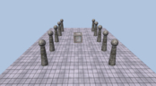
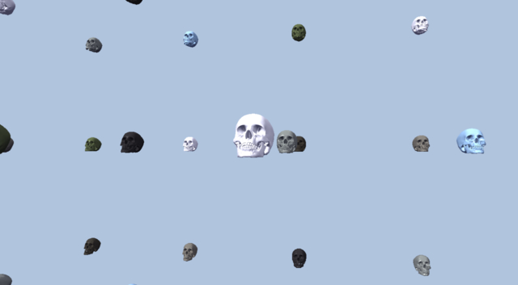
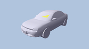
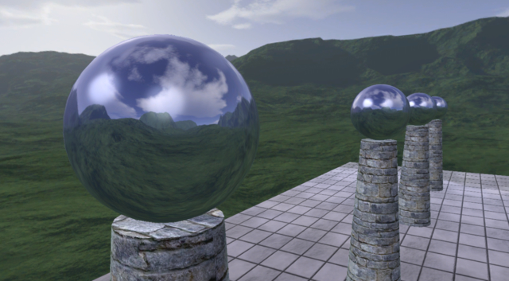
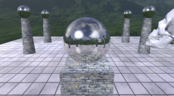
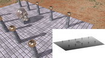
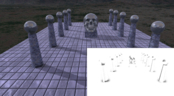
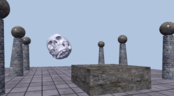
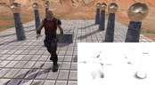

# What is this sorcery?

A collection of *DirectX 12 C# samples* from Frank D. Luna's book [Introduction to 3D Game Programming with Direct3D 12.0](http://d3dcoder.net/d3d12.htm). All the samples have been ported to .NET using [SharpDX](http://sharpdx.org/).

# Building

The samples will compile with Visual Studio 2022+ and run on Windows 10+ with DirectX 12 capable graphics hardware.

# Samples

The number prefix for sample name indicates its corresponding chapter from the book. 

Note that there might be issues: some which are inherited from the original C++ samples and some which have been introduced during the porting process. All known issues are listed in the [issues section](https://github.com/discosultan/dx12-game-programming/issues).

## [04-InitDirect3D](Samples/04-InitDirect3D)

Sets up a window using WinForms. Initializes Direct3D 12 and builds a base app with game loop upon which next samples are built.

## [06-Box](Samples/06-Box)

Manually defines vertices to render a colored box. Scene can be rotated and zoomed using mouse buttons.

## [07-Shapes](Samples/07-Shapes)

Generates geometric primitives. Renders multiple objects using a single vertex and index buffer.
  

## [07-LandAndWaves](Samples/07-LandAndWaves)

Constructs a heightmap based terrain and water geometry using a dynamic vertex buffer.
  

## [08-LitWaves](Samples/08-LitWaves)

Adds ambient, diffuse and specular lighting to the land and waves scene.
   

## [08-LitColumns](Samples/08-LitColumns)

Introduces parsing and loading a skull mesh from a custom model format. Applies lighting to the shapes scene.

## [09-Crate](Samples/09-Crate)

Textures a box with uv-coordinates added to its vertices.
  

## [09-TexWaves](Samples/09-TexWaves)

Animates a water texture in the land and waves scene.
  

## [09-TexColumns](Samples/09-TexColumns)

Textures objects in the shapes scene.
  

## [10-Blend](Samples/10-Blend)

Renders the land and waves scene with transparent water and a wire fence textures. Introduces the blending formula and creates a fog effect.

## [11-Stencil](Samples/11-Stencil)

Constructs a mirror using the stencil buffer and projects a shadow for the skull mesh.
  

## [12-TreeBillboards](Samples/12-TreeBillboards)

Renders trees as billboards. Introduces texture arrays and alpha to coverage in relation to MSAA.
  

## [13-VecAdd](Samples/13-VecAdd)

Sums a bunch of vectors on GPU instead of CPU for high parallelism using a compute shader. Outputs a *results.txt* file instead of rendering to screen.

## [13-WavesCS](Samples/13-WavesCS)
<!-- This sample looks exactly the same as 10-Blend -->

Uses a compute shader to update the land and waves scene waves simulation on GPU instead of CPU.

## [13-Blur](Samples/13-Blur)

Applies a Gaussian blur post-processing effect using a compute shader to the land and waves scene.

## [13-SobelFilter](Samples/13-SobelFilter)

Applies a Sobel filter post-processing effect using a compute shader to the land and waves scene to render outlines for geometry.

## [14-BasicTessellation](Samples/14-BasicTessellation)

Tessellates a quad using 4 control points.
  

## [14-BezierPatch](Samples/14-BezierPatch)

Tessellates a quad using 16 control points cubic Bézier surface.
  

## [15-CameraAndDynamicIndexing](Samples/15-CameraAndDynamicIndexing)

Creates a controllable first person camera. Introduces dynamic indexing of texture arrays. Camera is moved using WASD keys and rotated using a mouse.

## [16-InstancingAndCulling](Samples/16-InstancingAndCulling)

Renders multiple copies of the skull mesh using a hardware instanced draw call. Culls skulls outside of camera frustum.

## [17-Picking](Samples/17-Picking)

Enables picking individual triangles of a car mesh. Right mouse button picks a triangle which is highlighted using a yellow color.

## [18-CubeMap](Samples/18-CubeMap)

Renders a sky texture cube. Uses the cube to render reflections on scene objects.
  

## [18-DynamicCube](Samples/18-DynamicCube)

Renders scene objects into a texture cube every frame. Uses the rendered cube for reflections.
  

## [19-NormalMap](Samples/19-NormalMap)

Makes use of normal maps in addition to diffuse maps to generate more realistic lighting of surfaces.

## [20-Shadows](Samples/20-Shadows)

Projects shadows into a shadow map which is blended with the diffuse target.
  

## [21-Ssao](Samples/21-Ssao)

Computes real-time screen space ambient occlusion and applies it as a post-processing effect.
  

## [22-Quaternions](Samples/22-Quaternions)

Animates skull rotation using quaternions.
  

## [23-SkinnedMesh](Samples/23-SkinnedMesh)

Plays a walking animation for an animated skinned soldier mesh loaded from *.m3d* format.
