# What is this sorcery?

A collection of *DirectX 12 C# samples* from Frank D. Luna's book [Introduction to 3D Game Programming with Direct3D 12.0](http://d3dcoder.net/d3d12.htm). Samples have been ported to the .NET environment using [SharpDX](http://sharpdx.org/).

This repo contains all the samples from part 2 of the book - *Direct3D foundations*. There are no plans to port samples from part 3.

# Building

All the samples will compile with Visual Studio 2015+ and run on Windows 10 with DirectX 12 capable graphics hardware.

# Samples

## [InitDirect3D](Samples/InitDirect3D)

Sets up a basic Direct3D 12 enabled window. Introduces initializing Direct3D, setting up a game loop, building a base framework upon which next samples are built.

## [Box](Samples/Box)
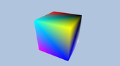

Renders a colored box. Introduces vertices and input layouts, vertex and index buffers, programmable vertex and pixel shaders, constant buffers, compiling shaders, rasterizer state, pipeline state object. 

## [Shapes](Samples/Shapes)
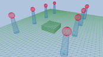

Renders multiple objects in a scene. Introduces using multiple world transformation matrices, drawing multiple objects from a single vertex and index buffer.

## [LandAndWaves](Samples/LandAndWaves)
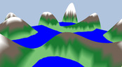

Constructs a basic terrain and animated water geometry. Introduces dynamic vertex buffers.

## [LitWaves](Samples/LitWaves)
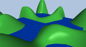

Adds lighting to the previous hills scene. Introduces diffuse, ambient and specular lighting, materials and directional lights. 

## [LitColumns](Samples/LitColumns)
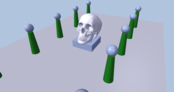

Introduces parsing and loading a skeleton model mesh from a custom model format. Applies lighting to the shapes scene.

## [Crate](Samples/Crate)
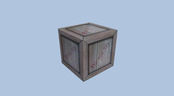

Introduces texturing and uv-coordinates on a simple box.
  

## [TexWaves](Samples/TexWaves)
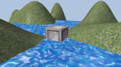

Introduces texture animations by animating the water texture in the hills scene.
  

## [TexColumns](Samples/TexColumns)
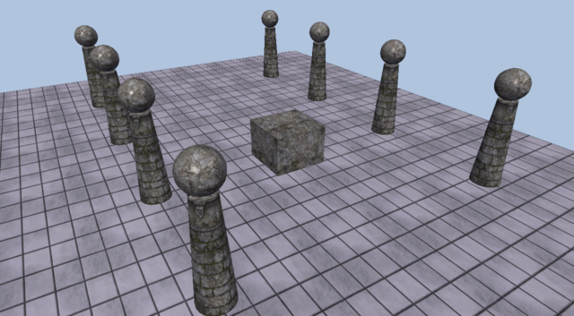

Renders the shapes scene with fully textured objects.
  

## [Blend](Samples/Blend)
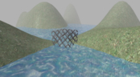

Renders the hills scene with transparent water and a wire fence box texture. Introduces the blending formula, how to configure a blend state in the graphics pipeline and how to create a fog effect.

## [Stencil](Samples/Stencil)
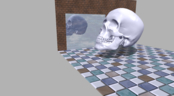

Constructs a mirror using stencil buffer. Introduces stenciling, projecting mirrored images and rendering shadows.

## [TreeBillboards](Samples/TreeBillboards)
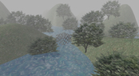

Renders trees as billboards. Introduces texture arrays and alpha to coverage in relation to MSAA.
  

## [VecAdd](Samples/VecAdd)

Sums a bunch of vectors on GPU instead of CPU for high parallelism. Introduces programmable compute shaders. Outputs a 'results.txt' file instead of rendering to screen.

## [WavesCS](Samples/WavesCS)

Uses compute shader to update the hills scene waves simulation on GPU instead of CPU.
  

## [Blur](Samples/Blur)
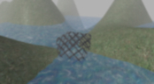

Applies a Gaussian blur post processing effect using compute shader to the hills scene. Introduces render targets. 

## [SobelFilter](Samples/SobelFilter)
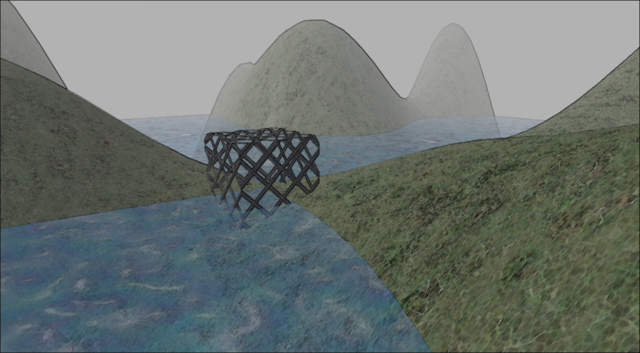

Applies a sobel filter post processing effect using compute shader to the hills scene to render strong outlines for geometry.

## [BasicTessellation](Samples/BasicTessellation)
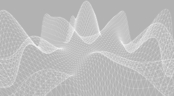

Tessellates a quad using 4 control points. Introduces programmable hull and domain shaders and the fixed tessellator stage. 

## [BezierPatch](Samples/BezierPatch)
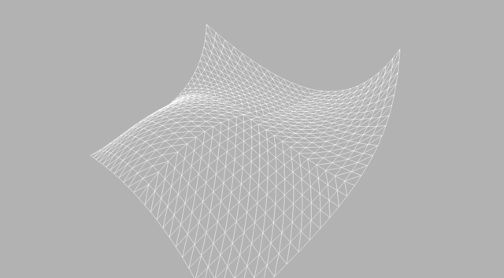

Tessellates a quad using 16 control points cubic Bézier surface.
